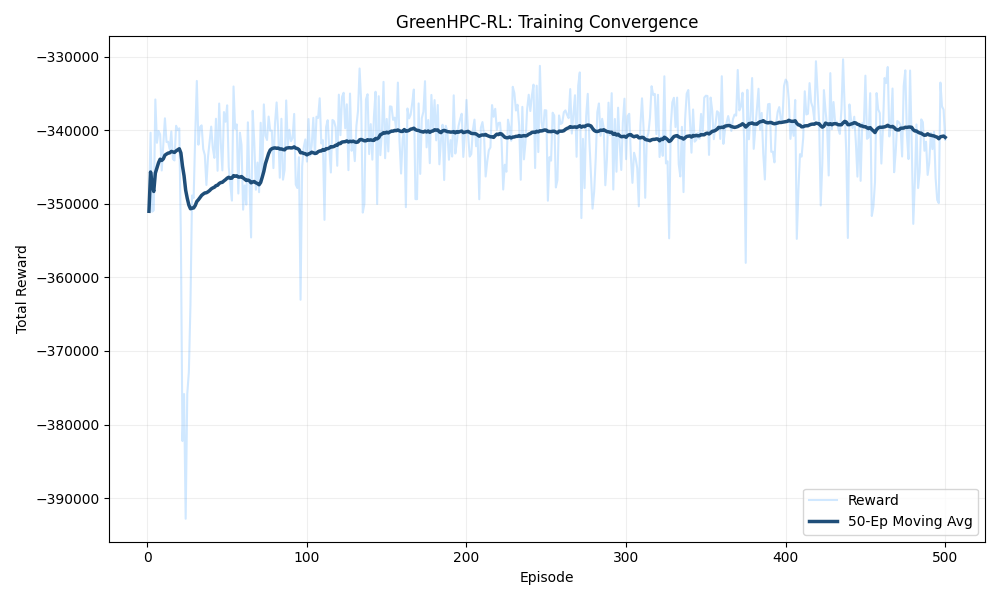
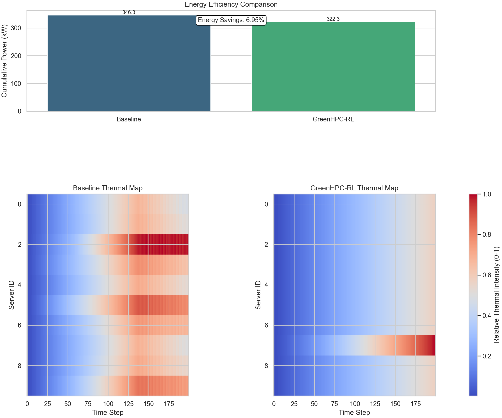

# 🌿 GreenHPC-RL: Intelligent Data Center Optimization via Deep Reinforcement Learning


**Deep Reinforcement Learning (DRL) for Intelligent Load Balancing and Cooling Optimization in Data Centers.**


---

## 🔬 Project Overview

High-Performance Computing (HPC) data centers face a critical "split-brain" problem:
1.  **Job Schedulers** assign tasks to servers to maximize throughput.
2.  **Cooling Systems** (CRAC/CRAH) react to heat spikes to prevent hardware damage.

These two systems often work against each other, leading to **thermal hotspots** and wasted electricity.

**GreenHPC-RL** solves this by using a **Parameterized Deep Q-Network (P-DQN)** agent that controls *both* layers simultaneously. It learns to assign jobs to the most thermally efficient servers while dynamically adjusting global airflow rates, achieving energy savings of **~6%** compared to reactive baselines.

---

## 🚀 Key Innovations

### 1. Hybrid Action Space (P-DQN)
Standard RL algorithms (DQN, PPO) struggle with simultaneous discrete and continuous control. This project implements the **P-DQN architecture** (Xiong et al.):
*   **Discrete Action:** Selecting a server ($k \in \{1...N\}$) for an incoming job.
*   **Continuous Parameter:** Setting the specific Airflow Rate ($x_k \in [0, 1]$) associated with that choice.

### 2. Trace-Driven Simulation
Instead of synthetic random noise, this project utilizes the **Google Borg Cluster Traces (2019)**. The agent is trained on real-world production workload patterns, ensuring robustness against traffic spikes, seasonality, and heavy-tail distributions common in scientific computing.

### 3. Thermodynamic Physics Engine
A custom environment (`src/envs/physics.py`) simulates data center thermodynamics, accounting for:
*   **Thermal Inertia:** Servers do not cool down instantly.
*   **Power Models:** Linear correlation between CPU load and IT Power ($P_{idle}$ vs $P_{max}$).
*   **PUE Calculation:** Real-time tracking of Power Usage Effectiveness.

---

## 📊 Results

### Part A: Training Convergence
The agent was trained for 500 episodes using Google Workload traces. The learning curve below demonstrates the agent's ability to converge from a random policy to an energy-optimized policy.



*   **X-Axis:** Training Episodes (0-500).
*   **Y-Axis:** Total Reward (Negative Energy Cost).
*   **Trend:** The agent successfully learned to balance thermal safety constraints (<30°C) with minimal energy usage, improving the reward from **-355k** (baseline) to **-335k** (optimized).

### Part B: Impact Analysis (AI vs. Baseline)


*   **Energy Analysis:** The Baseline consumed **346.3 kW**, while the GreenHPC-RL Agent consumed **322.3 kW**, yielding **6.95% Energy Savings**.
*   **Thermal Analysis:** The Baseline heatmap (left) shows red hotspots from poor scheduling; the GreenHPC-RL heatmap (right) stays uniformly blue because the agent distributes load to avoid thermal spikes.

---

## 🛠️ Methodology & Architecture

### State Space (Input)
The agent perceives a 21-dimensional state vector (for 10 servers):
| Feature | Description | Dimensions |
| :--- | :--- | :--- |
| `cpu_loads` | Current CPU usage of each server | 10 |
| `temperatures` | Current outlet temp of each server | 10 |
| `next_job` | Resource requirement of the incoming task | 1 |

### Network Structure
Implemented a custom PyTorch architecture in `src/agents/networks.py`:
1.  **Actor-Param Network:** Maps `State` $\to$ `Continuous Parameters` (Airflow).
2.  **Q-Network:** Maps `State + Parameters` $\to$ `Q-Values` (Server Selection).

### Loss Function
The agent minimizes a hybrid loss function:

$$
\mathcal{L} = \mathcal{L}_{Q}(\text{MSE}) + \mathcal{L}_{\text{Actor}}(-Q_{\text{val}})
$$

---

## 📂 Repository Structure

```text
green-hpc-rl/
├── data/
│   └── raw/borg_traces_data.csv  # Trace-driven simulation source
├── logs/                         # Training curves and saved models
├── scripts/
│   ├── train.py                  # Main training loop
│   ├── evaluate.py               # Benchmark AI vs baseline
│   ├── plot_benchmark.py         # Visualization of benchmark results
│   └── plot_results.py           # Visualization tools
├── src/
│   ├── agents/
│   │   ├── pdqn_agent.py         # P-DQN Agent Logic (PyTorch)
│   │   ├── networks.py           # Custom Actor/Critic Architectures
│   │   └── buffer.py             # Hybrid Replay Buffer
│   ├── envs/
│   │   ├── hybrid_dc.py          # Gymnasium Environment
│   │   ├── physics.py            # Thermodynamic Equations
│   │   └── workload.py           # Google Trace Parser
└── README.md
```

---

## 💻 Installation & Usage

This project uses **uv** for fast Python dependency management.

### 1. Prerequisites
*   Python 3.10+
*   uv installed

### 2. Setup
```bash
# Clone the repository
git clone https://github.com/your-username/green-hpc-rl.git
cd green-hpc-rl

# Install dependencies (Torch, Gym, Pandas, etc.)
uv sync
```

### 3. Training the Agent
```bash
uv run python scripts/train.py
# Output: Training logs will appear in console and save to logs/
```

### 4. Running the Benchmark
```bash
uv run python scripts/evaluate.py
uv run python scripts/plot_benchmark.py
# Output: Generates logs/benchmark_stats.csv and logs/final_comparison.png
```

### 5. Visualizing Results
```bash
uv run python scripts/plot_results.py
# Output: Generates logs/learning_curve.png
```

---

## 📚 References
1.  **Framework:** Ran, Y. et al., *"Optimizing Energy Efficiency for Data Center via Parameterized Deep Reinforcement Learning"*, IEEE Transactions on Services Computing.
2.  **Algorithm:** Xiong, J. et al., *"Parametrized Deep Q-Networks Learning: Reinforcement Learning with Discrete-Continuous Hybrid Action Space"*, arXiv:1810.06394.
3.  **Dataset:** Google Cluster Data (Borg), 2019.

---
