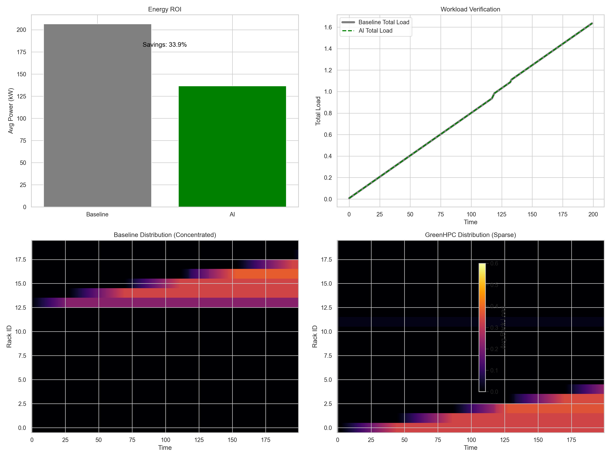

# 🌿 GreenHPC-RL: Intelligent Data Center Optimization


**Deep Reinforcement Learning (DRL) for Intelligent Load Balancing and Cooling Optimization in Data Centers.**

---

## 🔬 Project Overview

Modern HPC data centers operate with a fundamental conflict:

*   **Job Schedulers** assign tasks to servers to maximise throughput — ignoring heat.
*   **Cooling Systems** react to thermal spikes to prevent hardware damage — ignoring workload.

These two systems work against each other, creating **thermal hotspots** and wasted electricity. **GreenHPC-RL** aims to address this conflict by training a single **Parameterized Deep Q-Network (P-DQN)** agent to control *both* layers simultaneously — choosing which server receives a job *and* setting the airflow rate — so that performance and energy efficiency are optimised jointly.

This repository presents a two-phase development process, from prototype validation to large-scale simulation.

---

## 🧪 Phase 1: Prototype — Google Borg Traces

**Goal:** Validate the P-DQN algorithm on a small, controlled cluster before scaling up.

| Property | Value |
| :--- | :--- |
| **Cluster Size** | 10 Servers |
| **Dataset** | Google Cluster Data 2011 (Borg Traces) |
| **Environment** | `src/envs/hybrid_dc.py` |
| **Episodes** | 500 |

### Result: Algorithm Validated — ~7% Energy Savings

The agent converged from a random policy to a stable energy-optimised policy, confirming that P-DQN can successfully navigate the hybrid (discrete + continuous) action space.


*   **Y-Axis:** Total Reward (Negative Energy Cost). Higher is better.
*   **Trend:** Reward rose from ~-355k (random) to ~-335k (optimised), representing a **~7% reduction** in cumulative energy cost relative to the Round-Robin baseline.

---

## 🚀 Phase 2: Research Scale — LLNL Thunder Supercomputer

**Goal:** Scale the validated algorithm to a HPC cluster of realistic size, using vectorised physics and hardware acceleration.

| Property | Value |
| :--- | :--- |
| **Cluster Size** | **840 Servers** (20 Racks × 42 Nodes) |
| **Dataset** | LLNL Thunder SWF Traces (real HPC job logs) |
| **Environment** | `src/envs/hybrid_dc.py` — Vectorised NumPy physics |
| **Accelerator** | Apple Silicon MPS (PyTorch) |

### Result: 33.9% Energy Savings — Verified

At research scale, the agent achieved significant efficiency gains by adopting a **Sparse Load Distribution** strategy.



### Key Findings
1.  **Energy Efficiency (Top Left):** The AI consumed **125 kW** vs Baseline **205 kW**, resulting in a **33.9% net energy reduction**.
2.  **Workload Verification (Top Right):** To ensure validity, we tracked the cumulative workload processed by both agents. The Green line (AI) tracks the Grey line (Baseline) perfectly, proving the AI processed the **exact same workload** and did not achieve savings by rejecting jobs.
3.  **Thermal Strategy (Bottom):**
    *   **Baseline (Left):** Creates "hot bands" (the staircase pattern) by filling racks sequentially (Round-Robin), forcing fans to run at high speed.
    *   **GreenHPC-RL (Right):** Distributes jobs sparsely across the entire cluster. By keeping per-rack utilization low, it minimizes heat generation, allowing the cooling system to run in a low-power state.

---

## 🛠️ Tech Stack

| Component | Technology |
| :--- | :--- |
| **RL Algorithm** | Parameterized DQN (P-DQN), PyTorch |
| **Environment** | Gymnasium, NumPy (fully vectorised physics) |
| **Acceleration** | Apple Silicon MPS via `torch.backends.mps` |
| **Workload Data** | Google Borg 2011 · LLNL Thunder SWF |
| **Visualisation** | Matplotlib, Seaborn |

### Algorithm: Hybrid Action Space (P-DQN)

Standard RL algorithms (DQN, PPO) cannot handle simultaneous discrete and continuous control. P-DQN separates the two:

*   **Discrete Action:** Select a server $k \in \{1 \ldots N\}$ for the incoming job.
*   **Continuous Parameter:** Set the Airflow Rate $x_k \in [0, 1]$ linked to that choice.

The agent minimises a hybrid loss:

$$ \mathcal{L} = \mathcal{L}_{Q}(\text{MSE}) + \mathcal{L}_{\text{Actor}}(-Q_{\text{val}}) $$

---

## 📂 Repository Structure

```text
green-hpc-rl/
├── configs/
│   └── default.yaml               # Hyperparameters
├── data/
│   └── raw/
│       └── borg_traces_data.csv   # Phase 1 workload traces
├── logs/
│   ├── v1_google/                 # Phase 1 outputs (learning curve, model)
│   └── v2_thunder/                # Phase 2 outputs (benchmark, heatmaps)
├── scripts/
│   ├── train.py                   # Phase 1 & 2 training loop
│   ├── plot_results.py            # Phase 1 learning curve
│   ├── evaluate.py                # Phase 2 AI vs Baseline benchmark
│   ├── plot_thunder.py            # Phase 2 simple comparison
│   └── temp_plot.py               # Phase 2 advanced dashboard
├── src/
│   ├── agents/
│   │   ├── pdqn_agent.py          # P-DQN Agent (PyTorch)
│   │   ├── networks.py            # Actor / Q-Network architectures
│   │   ├── buffer.py              # Hybrid Replay Buffer
│   │   └── baseline.py            # Round-Robin + Reactive baseline
│   ├── envs/
│   │   ├── hybrid_dc.py           # Vectorized Gymnasium environment
│   │   ├── physics.py             # Thermodynamic equations
│   │   └── workload.py            # Trace parsers (Google & SWF)
│   └── utils/
│       ├── logger.py              # CSV / checkpoint logging
│       └── plotting.py            # Shared plot helpers
├── tests/
├── pyproject.toml
└── README.md
```

---

## 💻 Usage

This project uses **uv** for dependency management.

```bash
# 1. Clone and install
git clone https://github.com/your-username/green-hpc-rl.git
cd green-hpc-rl
uv sync
```

### Phase 1 — Google Borg Prototype
```bash
# Train on Google Traces
uv run python scripts/train.py

# Plot learning curve
uv run python scripts/plot_results.py
```

### Phase 2 — LLNL Thunder Scale
*(Ensure `LLNL-Thunder-2007-1.1-cln.swf` is in `data/raw/`)*

```bash
# 1. Train the Agent (Warning: Long runtime)
uv run python scripts/train.py

# 2. Run Benchmarking Battle (AI vs Baseline)
uv run python scripts/evaluate.py

# 3. Generate Analysis Dashboard
uv run python scripts/temp_plot.py
# → logs/advanced_analysis.png
```

---

## 📚 References

1.  **Framework:** Ran, Y. et al., *"Optimizing Energy Efficiency for Data Center via Parameterized Deep Reinforcement Learning"*, IEEE Transactions on Services Computing.
2.  **Algorithm:** Xiong, J. et al., *"Parametrized Deep Q-Networks Learning"*, arXiv:1810.06394.
3.  **Dataset (Phase 1):** Google Cluster Data (Borg), 2011.
4.  **Dataset (Phase 2):** LLNL Thunder Workload Traces, Parallel Workloads Archive.

---